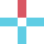

# 2d-战旗
Unity项目

## 行动类介绍  

ActionClass，所有行动的父类  
重要属性：  

public int actionID;//行动id，唯一标识

public int damage;//行动伤害，某些行动无伤害

public int cooldown;//行动冷却

public int actionPointCost;//行动消耗技能点

public int maxRedGridNum;//最大攻击格子数

public TargetType targetType;//攻击目标类型

public List<Vector2> pointToPoint = new List<Vector2>();//能释放的相对位移格子

重要方法：
public virtual bool IsMeetAnyBuff()//是否满足什么前置buff，默认是需要控制没有眩晕Buff

public bool CheckIsMeetTarget(Character targetCharacter)//是否满足攻击目标为可选目标

## 子类介绍
ActionClass有4个子类 分别为 DelayAction DelayWaitAction InstantAction WaitAction ,分别代表延时行动，延时等待行动，立即行动，立即等待行动  
DelayAction代表行动释放后会等待几个回合，直到几个回合后优先执行，不会造成位移  
DelayWaitAction代表行动释放后，直到几个回合后优先执行，但是会造成位移  
InstantAction代表行动释放后，将会立即执行，不会造成位移  
WaitAction代表行动释放后，将会立即执行，但是会造成位移  

## 行动配置表
行动配置表是在ActionClass的Awake()函数中进行  
1.类的结构  

            public class ActionTypeInfo
            {
                        public Type actionType { get; private set; }
                        //商店中出现的权重
                        public int weightValue { get; private set; }
                        //商店中该行动的价格
                        public int price { get; private set; }
                        public string actionName { get; private set; }
                        public string actionExplain{ get; private set; }
                        public int damage, cooldown, actionPointCost, maxRedGridNum;
                        public TargetType targetType;
                        //这个是用来局外成长的，是否解锁
                        public bool isUnlock;
                        
                        
                        public ActionTypeInfo(Type actionType, int weightValue,int price,  string actionName, string actionExplain, 
                        int damage, int cooldown, int actionPointCost, int maxRedGridNum,TargetType targetType,bool isUnlock)
                        {
                        this.actionType = actionType;
                        this.weightValue = weightValue;
                        this.price = price;
                        this.actionName = actionName;
                        this.actionExplain = actionExplain;
                        this.damage = damage;
                        this.cooldown = cooldown;
                        this.actionPointCost = actionPointCost;
                        this.maxRedGridNum = maxRedGridNum;
                        this.targetType = targetType;
                        this.isUnlock = isUnlock;
                        }
            }

2.配置表  

            public static Dictionary<int, ActionTypeInfo> actionIDToType = new Dictionary<int, ActionTypeInfo>()
            {
                {0, new ActionTypeInfo(typeof(Move), 10,2, "移动","移动至指定位置",0,1,1,1,TargetType.Space,true)},
                {1, new ActionTypeInfo(typeof(BoxingAction), 10,5, "武器攻击","攻击目标，造成一点伤害",1,1,1,1, TargetType.Character, true)},
                ......
            }
3.ActionClass中的初始化，根据actionId  

            public void Awake()
            {   
                character = GetComponent<Character>();
                animator = GetComponent<Animator>();
                spriteRenderer = GetComponent<SpriteRenderer>();
                yellows = GetComponent<Yellow>();
                actionIcon = Resources.Load<Sprite>("Action/"+GetType().Name);
                InitActionValue();
            }
            public void InitActionValue()
            {
                damage = SaveClass.actionIDToType[actionID].damage;
                cooldown = SaveClass.actionIDToType[actionID].cooldown;
                actionPointCost = SaveClass.actionIDToType[actionID].actionPointCost;
                maxRedGridNum = SaveClass.actionIDToType[actionID].maxRedGridNum;
                targetType= SaveClass.actionIDToType[actionID].targetType;
            
            }
## buff类介绍  
buff类使用类似行动类来使用id用来作为唯一标识，但是在施加buff时并非储存id，而是一个List<BuffClass>  
基类代码  

            public abstract class BuffClass:ScriptableObject
            {
                public Sprite buffIcon;
                public virtual string buffRealExplain
                {
                    get
                    {
                        if (isOnlyOne)
                        {
                            return "\n只能有一个";
                        }
                        else
                        {
                            if (isOverlap)
                            {
                                if (UpLimit == -1)
                                {
                                    return "\n可叠加";
            
                                }
                                else
                                {
                                    return "\n可叠加,上限为" + UpLimit;
                                }
                            }
                            else
                            {
                                return "\n可以有多个，但是不会叠加";
                            }
                        }
                    }
                }
            
                public int buffId; 
                public void Initialize(int duration)
                {
                    this.duration = duration;
            
                    this.buffIcon = Resources.Load<Sprite>("Buff/"+GetType().Name);
            
                    InitBuffValue();
            
                }
                public void InitBuffValue()
                {
                    buffName = SaveClass.buffIDToType[buffId].buffName;
                    buffExplain = SaveClass.buffIDToType[buffId].buffName;
                    isOnlyOne = SaveClass.buffIDToType[buffId].isOnlyOne;
                    isOverlap = SaveClass.buffIDToType[buffId].isOverlap;
                    UpLimit = SaveClass.buffIDToType[buffId].UpLimit;
                    buffAttribute= SaveClass.buffIDToType[buffId].buffAttribute;
                    
            
            
                }
            
                public string buffName;
            
                public string buffExplain;
            
                public bool isOnlyOne;
            
                public bool isOverlap;
            
            
                public int UpLimit=-1;//-1代表无上限
            
                public BuffAttribute buffAttribute;
            
            
            
                public int duration;
            
                public abstract void ApplyEffect(Character character);
            
                public abstract void TickBegin(Character character);// 检查位置 UIManager 每个角色开始回合时触发
                
                public abstract void TickEnd(Character character);// 检查位置 UIManager 每个角色开始结束时触发
            
            
            }

由于继承了ScriptableObject，不能使用构造函数来初始化在施加buff时,颇显复杂，举例如下  

        {
                    BuffType buffType = ScriptableObject.CreateInstance<buffType>();//此行是通用的  
                    buffType.Initialize(2);//初始化buff，如果有新参数，可加
                    character.AddBuff(buffType);//对角色施加该buff
        }

        

### 举例说明如何创造新行动  
1.最普通的攻击  
它的效果是攻击单个敌人，范围是周围一格    
  
白色是角色位置，蓝色为可攻击到的位置  
  
红色为鼠标位置，也是攻击效果的位置，也就是说鼠标所在的位置也是目标的位置  

                        
            public class BoxingAction : InstantAction
            {
            
                private new void Awake()
                {
                    actionID = 1;//行动的位移标识，必须首要标明
                    base.Awake();//用来进行配置表和其他操作
            
                    
                    //设置可选的相对位置 在此例中是周围8格
                    pointToPoint = new List<Vector2> { new Vector2(1, 0), new Vector2(0, 1),  new Vector2(-1, 0),  new Vector2(0, -1),new Vector2(1,1), new Vector2(1, -1), new Vector2(-1, 1), new Vector2(-1, -1) };
            
                    //一个记录
                    lastTimeAction = -100;
                }
            
                public override void MakeDirection()
                {        
                        //设置能攻击的位置，在此例中是攻击选定格的目标
                        directions = new List<Vector2>() { mouseRelativeSelf };   
                }
            
            
            
            
                public override IEnumerator CheckTarget()
                {
                    //是用来等待动画播放到什么时候开始真正开始生效攻击，此例中是指动画做到80%就开始真正生效，用来给玩家增加体验的
                    yield return new WaitForSeconds(0.8f * clipLength);
            
                    foreach (Vector2 direction in directions)
                    {
                        Vector2 targetPos =selfVector2 + direction;//找到真正位置坐标，通过自己位置增加相对位置
            
                        if (GridManager.Instance.IsInBox(targetPos))//判断是否在格子内
                        {
                            Grid targetGrid = GridManager.Instance.gridsXY[(int)targetPos.x, (int)targetPos.y];
                            if (CheckIsMeetTarget(targetGrid.gridCharacter))//判断是否是会攻击的目标
                            {
                                targetGrid.gridCharacter.ReceiveDamage(character, damage);//攻击
                            }
                        }
                    }
                           
                }
            
            }
2.带buff的行动  
此处举例为PoisonBowAction，也是一个远程攻击手段

            public class PoisonBowAction : InstantAction
            {
            
            
                private new void Awake()//同上述例子
                {
                    actionID = 38;
                    base.Awake();
                    for (int x = -3; x < 4; x++)
                    {
                        for (int y = -3; y < 4; y++)
                        {
                            pointToPoint.Add(new Vector2(x, y));//表明攻击的范围是一个正方形
                        }
                    }
                    lastTimeAction = -100;
                }
                public override void MakeDirection()//同上述例子
                {
                    directions = new List<Vector2>() { mouseRelativeSelf };
                }
            
            
            
                public override IEnumerator CheckTarget()
                {
                    yield return new WaitForSeconds(0.8f * clipLength);
            
                    foreach (Vector2 direction in directions)
                    {
                        Vector2 targetPos = selfVector2 + direction;
            
                        if (GridManager.Instance.IsInBox(targetPos))
                        {
                            Grid targetGrid = GridManager.Instance.gridsXY[(int)targetPos.x, (int)targetPos.y];
            
            
                            if (CheckIsMeetTarget(targetGrid.gridCharacter))
                            {
            
                                    //buff添加
                                PoisonBuff poisonBuff = ScriptableObject.CreateInstance<PoisonBuff>();
                                poisonBuff.Initialize(2);
                                targetGrid.gridCharacter.AddBuff(poisonBuff);//对目标格子上的角色施加PoisonBuff
                                    //此时只是增加buff，buff的具体实现在其他位置
                                targetGrid.gridCharacter.ReceiveDamage(character, damage);
            
                        
                            }
            
                        }
                    }
            
                }
            
            }

 PoisonBuff实现           
   
            public class PoisonBuff : BuffClass
            {
            
                public override string buffRealExplain
                {
                    get { return buffName + "\n在" + duration + "回合内" + buffExplain + base.buffRealExplain; }
                }
                public new void Initialize(int duration)
                {
            
                    buffId = 16;
            
                    base.Initialize(duration);
            
                }
            
                public override void ApplyEffect(Character character)
                {
            
                    character.ReceiveDamage(null, duration);
            
                }
            
                
                public override void TickBegin(Character character)//实现回合开始时中毒
                {
                    ApplyEffect(character);
                    duration--;
                    if (duration <= 0)
                    {
            
                        character.RemoveBuff(this);
                    }
                    
            
            
                }
            
                public override void TickEnd(Character character)
                {
            
                }
            }
            
3.攻击目标与鼠标位置不一致的攻击  
看完上述例子，你可能会疑惑directions得作用，因为上述例子中，都是攻击目标与鼠标位置相同的例子  
下边这个是不同的例子  
它的效果是攻击范围是上下左右两格   
  
白色是角色位置，蓝色为可攻击到的位置  
  
红色为攻击效果的位置，也就是说鼠标所在的位置如果在（0,1）或者（0,2）中，攻击的范围均为红色位置  
代码如下
            public class LungeAction : InstantAction
            {
            //注意，其实上述第一个例子是没有这个的，而第二个例子是有的
            //这个是投掷物，对于贴身近战，往往只用角色的动画表现即可，但是对于 弓（远程） 或者此例（长距离攻击），是需要其他游戏物体帮助的
            //虽然他们对游戏逻辑不占用，但是对于玩家的体验来说至关重要
                public GameObject missile;
            
               
                private new void Awake()
                { 
                    actionID = 3;
        
                    base.Awake();
                    //注意它的攻击范围
                    pointToPoint = new List<Vector2> { new Vector2(1, 0), new Vector2(2, 0), new Vector2(0, 1), new Vector2(0, 2), new Vector2(-1, 0), new Vector2(-2, 0), new Vector2(0, -1), new Vector2(0, -2) };
            
            
                    lastTimeAction = -100;
                   //加载投掷物
                    missile = GameObject.Instantiate(Resources.Load<GameObject>("Missile/LungeAction"));
                    missile.SetActive(false);
                }
            
            
                public  override void  MakeDirection()
                {
              
                        //设置攻击范围
                    if (mouseRelativeSelf == new Vector2(2, 0)|| mouseRelativeSelf == new Vector2(1, 0))
                    {            
                        directions = new List<Vector2>() { allDirections[0], allDirections[1] };
                    }
                    else if (mouseRelativeSelf == new Vector2(-2, 0) || mouseRelativeSelf == new Vector2(-1, 0))
                    {
                        directions = new List<Vector2>() { allDirections[2], allDirections[3] };
                    }
                    else if (mouseRelativeSelf == new Vector2(0, 2) || mouseRelativeSelf == new Vector2(0, 1))
                    {
                        directions = new List<Vector2>() { allDirections[4], allDirections[5] };
                    }
                    else if (mouseRelativeSelf == new Vector2(0, -2) || mouseRelativeSelf == new Vector2(0, -1))
                    {
                        directions = new List<Vector2>() { allDirections[6], allDirections[7] };
                    }
                }
                        //这个函数进行了重写，因为添加了投掷物
                public override void MakeAnimator()
                {
                        
                        
                     base.MakeAnimator();
            
                        //投掷物的出现
                    missile.SetActive(true);
            
            
                    if (mouseRelativeSelf.y==0)
                    {
                        if(mouseRelativeSelf.x>0)
                        {
                            missile.transform.position=transform.position+new Vector3(1,0);
                            missile.transform.rotation = Quaternion.identity;
                        }
                        else
                        {
                            missile.transform.position = transform.position - new Vector3(1, 0);
                            missile.transform.rotation = Quaternion.Euler(new Vector3(0, 0, 180));
                        }
                    }
                    else
                    {
                        if (mouseRelativeSelf.y > 0)
                        {
                            missile.transform.position = transform.position + new Vector3(0, 1);
                            missile.transform.rotation = Quaternion.Euler(new Vector3(0, 0, 90));
                        }
                        else
                        {
                            missile.transform.position = transform.position - new Vector3(0, 1);
                            missile.transform.rotation = Quaternion.Euler(new Vector3(0, 0, -90));
                        }
                    }
            
            
                    missile.GetComponent<Animator>().Play("1", 0, 0);
            
                    StartCoroutine(WaitForDestroyMission(0.5f));
            
                }
            
            
            
                public override IEnumerator CheckTarget()
                {
                    yield return new WaitForSeconds(0.8f * clipLength);
            
                    foreach (Vector2 direction in directions)
                    {
                        Vector2 targetPos = GridManager.Instance.WorldToGridPosition(transform.position) + direction;
            
                        if (GridManager.Instance.IsInBox(targetPos))
                        {
                            Grid targetGrid = GridManager.Instance.gridsXY[(int)targetPos.x, (int)targetPos.y];
            
            
                            if (CheckIsMeetTarget(targetGrid.gridCharacter))
                            {
                                
                                targetGrid.gridCharacter.ReceiveDamage(character, damage);
                            }
            
            
                        }
                    }
                     
                    
                }
            
            
                
            
                        //隐藏投掷物
                IEnumerator WaitForDestroyMission(float time)
                {
                    yield return new WaitForSeconds(time);
            
                    missile.SetActive(false);
            
                    missile.transform.position = new Vector2(100, 100);
            
                    
                }
            }

